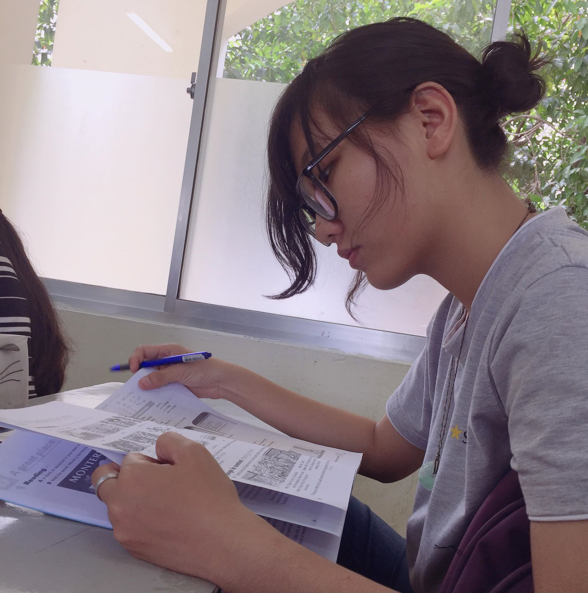

# Hi, I'm Yun! 👋

## 🔗 Links to my social profile

**🌞 Quan Bích Vân - Aka: Yun**
## 🚀 About Me
- My name is Quan Bich Van, but you can call me Yun.
- I'm a second-year student at FPT Polytechnic College in Ho Chi Minh City, Vietnam.
- I primarily work with C# and also have knowledge in Java.
- I'm on the path to becoming a full-stack developer, gaining experience in C#, Java, and ReactJS along the way.

   
   

-<kbd>

</kbd>-

   >
   

   📫 How to reach me: <a href='mailto:quanbichvan1@gmail.com'>quanbichvan1@gmail.com</a>

<!---
## 🤓 My Stats

quanbichvan2/quanbichvan2 is a ✨ special ✨ repository because its `README.md` (this file) appears on your GitHub profile.
You can click the Preview link to take a look at your changes.
--->
## 🛠 Skills
#### I can using
- **Tool:**
    + Github
    + Azure / AWS
    + Figma / Adobe Illustrator
    + Postman / Swagger
    + Docker
- **Technology:**
    + C#:
        + WPF / Winform (Desktop Application)
        + ASP.Net Core (Web Application; Backend)
        + Blazor Wasm / Razor Page (Web Application; Frontend)
    + JavaScript: 
        + AngularJs / Vanila JavaScript (Web Application;)
    + Typescript:
        + ReactJs (Web Application;)
    + Css:
        + TailwindCss / Boostrap (Web Application;)
    + Java:
        + Java Swing / JavaFX (Desktop Application)
        + Spring Boot (Web Application; Backend)
- **Relational Database:**
    + Microsoft SQL Server
    + MySQL
    + PostgreSQL
    + Azure SQL Database

<!--
**quanbichvan2/quanbichvan2** is a ✨ _special_ ✨ repository because its `README.md` (this file) appears on your GitHub profile.

Here are some ideas to get you started:

- 🔭 I’m currently working on ...
- 🌱 I’m currently learning ...
- 👯 I’m looking to collaborate on ...
- 🤔 I’m looking for help with ...
- 💬 Ask me about ...
- 📫 How to reach me: ...
- 😄 Pronouns: ...
- ⚡ Fun fact: ...
-->
